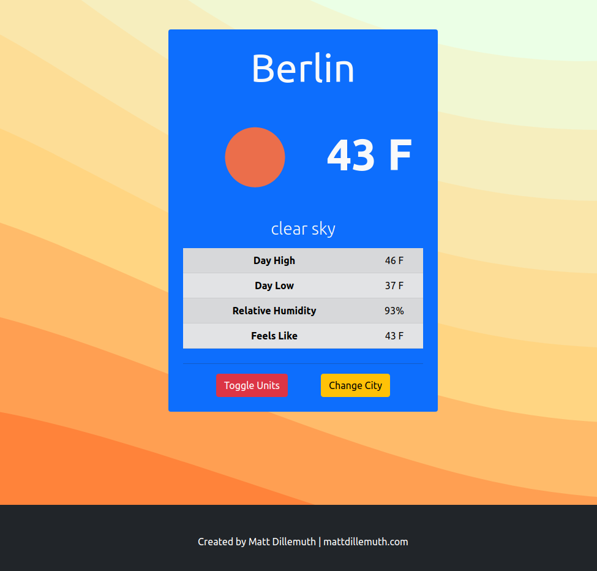

# Simple Weather App

A small web application that allows the user to view weather of a city that they provide

[Go to live weather app](https://mdillemuth.github.io/weather-app/)

## Screenshots

## Technology Used

- This app has been built with HTML, CSS (Bootstrap), JS (jQuery)

- OpenWeather API https://openweathermap.org/api

## Credits

The first iteration of this application was originally based off of the WeatherJS project found in Brad Traversy's [Learn JavaScript from the Beginning](https://www.udemy.com/course/modern-javascript-from-the-beginning/), available on Udemy for purchase.

## Future Plans

If I decide to invest more time into this project, I would like to work with the AccuWeather API - https://developer.accuweather.com/. It seems to be able to provide more comprehensive endpoints for location.

## License

MIT @mdillemuth
